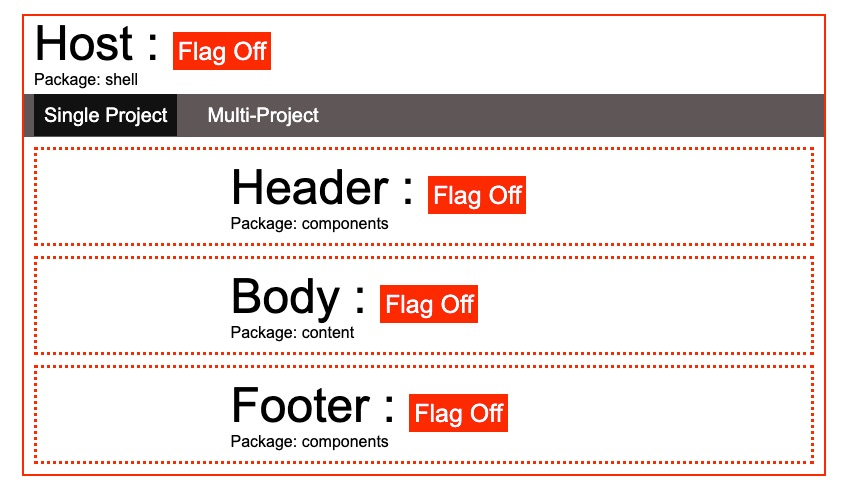
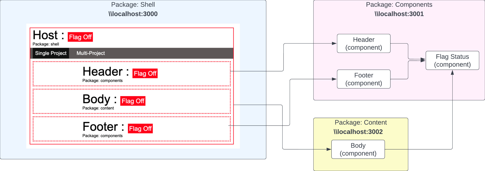
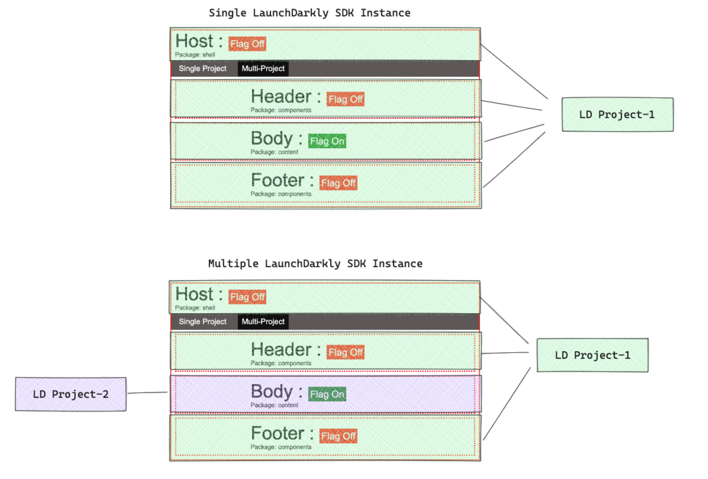
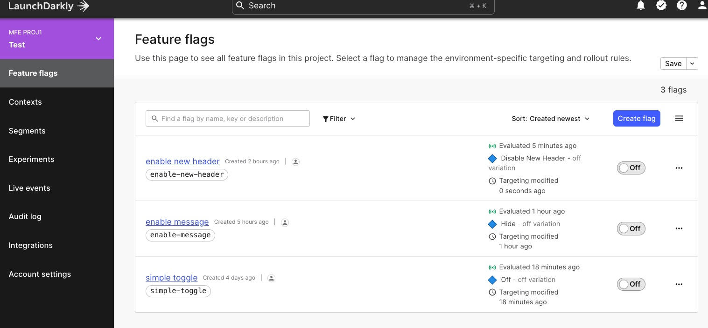
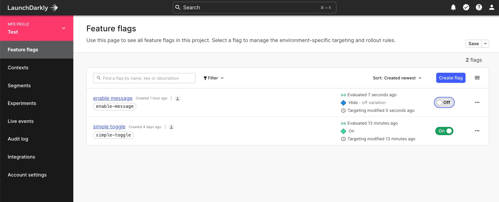

# README
This is a sample micro frontend application(MFE) demonstrating the following use-cases:
* Using a single LaunchDarkly React client SDK instance
* Using multiple LaunchDarkly React client SDK instance

## Overview


## Packages


## LaunchDarkly Project Scope


## Tech Stack
* [Reach v18.x](https://react.dev/blog/2022/03/29/react-v18)
* [Webpack 5 Module Federation](https://module-federation.github.io/)
* [LaunchDarkly Feature Management Platform](https://launchdarkly.com/)

## Requirements
* NodeJS  >=v16.x
* React v18.x
* Webpack v5.x
* LaunchDarkly Account


## Setup
### Feature Flags
Create the following feature flags using the specified flag keys.

| Project | flag key | flag type | decription|
|---|---|---|---|
|Proj-1, Proj-2|simple-toggle| boolean|toggles flag status on page components|
|Proj-1, Proj-2|enable-message| boolean|toggles message displayed in the body component|
|Proj-1|enable-new-header| boolean|toggles new Header component|

LD Proj-1

LD Proj-2



>`NOTE` : update the Root project.json and set your LaunchDarkly project client side Id
```
"start:content": " CONTENT_CLIENT_ID="Client side ID" npm --prefix packages/content start",
    "start:shell": "SHELL_CLIENT_ID="Client side ID" npm --prefix packages/shell start"
```

1. Install dependencies.

```
npm run install:components
npm run install:content
npm run install:shell
```

2. Run the following npm scripts in sequence in separate terminals
   
 
```
npm run start:components
npm run start:content
npm run start:shell
```


